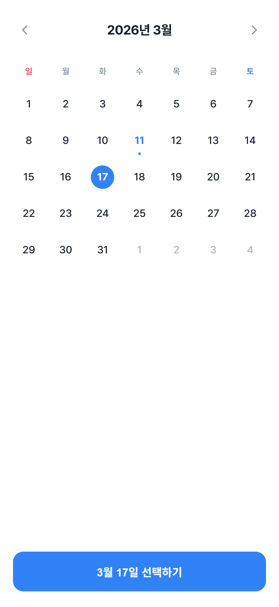
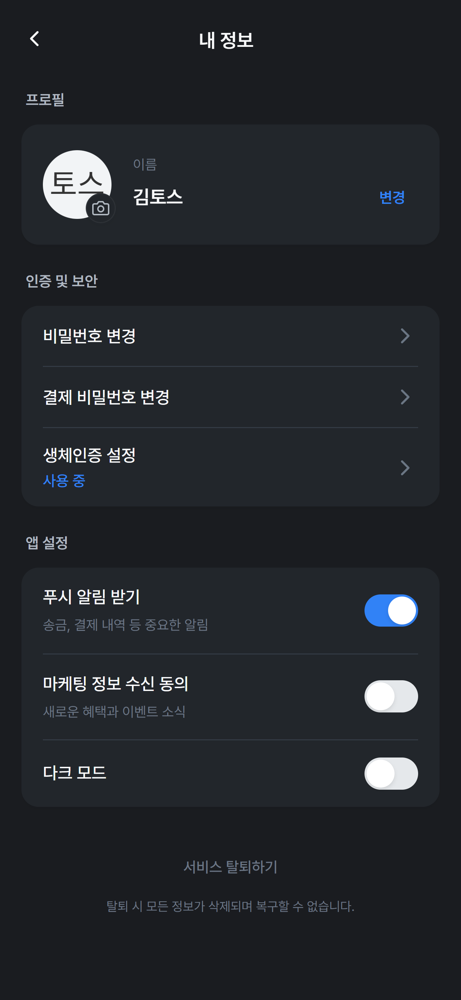

# Toss Tech Design 참고 스킬

> Toss Tech Design 아티클을 참고해 만든 비공식 스킬 팩입니다.
>
> Toss Tech Design 아티클에서 드러나는 제품 사고, 리서치 운영, 내부 툴, UX Writing, 접근성, 브랜드 판단 방식을 참고할 수 있도록 정리했습니다.

## 데모 미리보기

- 아래 UI 이미지는 이 스킬로 만든 데모 화면입니다.
- 이미지 생성에 사용한 모델: `Google Gemini 3.1 Pro`

> [!TIP]
> 디자인 시안이나 UI 결과는 제 경험상 Gemini 계열이 꽤 잘 나오는 편이었습니다. 특히 디자인 지향 작업은 `Google Gemini 3.1 Pro` 쪽 결과가 상대적으로 안정적이라고 느꼈습니다.

| 캘린더 / 날짜 선택 | 프로필 / 설정 |
|---|---|
|  |  |

## 빠른 설치

### 권장 설치 (`npx`)

가장 간단한 설치 방법입니다.

```bash
npx skills add Ilbie/Toss-Design-Skill
```

- Claude Code, OpenCode, Codex 계열에서 쓰는 범용 skills CLI 방식입니다.

### 수동 설치 (`git clone`)

환경에 따라 직접 경로를 지정해서 설치하고 싶다면 아래 명령어를 사용하면 됩니다.

### OpenCode

```bash
mkdir -p ~/.config/opencode/skills && git clone https://github.com/Ilbie/Toss-Design-Skill ~/.config/opencode/skills/toss-tech-design
```

### Claude Code

```bash
mkdir -p ~/.claude/skills && git clone https://github.com/Ilbie/Toss-Design-Skill ~/.claude/skills/toss-tech-design
```

### Codex

```bash
mkdir -p ~/.agents/skills && git clone https://github.com/Ilbie/Toss-Design-Skill ~/.agents/skills/toss-tech-design
```

## 구성

- `SKILL.md` - 실제로 불러서 쓰는 스킬 본문
- `sources/toss-tech-design-summary.md` - Toss Tech 디자인 아티클을 바탕으로 정리한 참고 요약본
- `sources/toss-tech-design-summary.md`는 참고용 요약이며 원문을 대체하지 않습니다. 정확한 맥락과 해석이 필요하면 원문을 우선 확인해 주세요.

## 사용 방법

원하는 환경의 skills 디렉터리에 이 저장소를 그대로 복사해 사용하면 됩니다.

- OpenCode: `~/.config/opencode/skills/toss-tech-design/`
- Claude Code: `~/.claude/skills/toss-tech-design/`
- Codex 계열: `~/.agents/skills/toss-tech-design/`

## 참고 및 출처

- 1차 참고 출처: `https://toss.tech/category/design`
- 이 저장소는 `toss.tech`의 디자인 아티클을 참고해 작성했습니다.
- 세부 참고 내용은 `sources/toss-tech-design-summary.md`에 정리되어 있습니다.
- Toss, 토스, toss.tech 및 관련 상표, 서비스명, 원문 아티클의 권리는 각 권리자에게 있습니다.

## 비제휴 안내

- 이 저장소는 Toss(비바리퍼블리카) 또는 관련 조직과 공식적인 관련, 승인, 후원, 제휴가 없는 비공식 저장소입니다.
- Toss의 화면, 브랜드, 컴포넌트, 아이콘, 문구를 그대로 복제하기 위한 목적이 아니라, 아티클에서 드러나는 사고방식과 설계 원칙을 참고하기 위한 목적으로 작성했습니다.

## 문의 및 삭제 요청

- 권리자 또는 이해관계자께서 본 저장소 내용이 문제가 된다고 판단하시면 GitHub Issue로 연락해 주세요.
- 공개 Issue가 어려우면 GitHub 프로필을 통한 연락 수단으로 알려 주셔도 됩니다.
- 확인 후 필요하면 즉시 수정, 비공개 전환, 또는 삭제 조치하겠습니다.

## 주의사항 및 면책

- 이 저장소는 법률 자문이 아니며, 이 스킬을 사용해 생성하거나 배포한 결과물의 책임은 사용자에게 있습니다.
- 특히 Toss의 UI/UX를 과도하게 모사하는 결과물은 문제를 일으킬 수 있습니다.
- Toss, 토스, toss.tech 명칭이나 로고, 마크, 캠페인 문구 등 브랜딩 요소를 결과물에 그대로 사용하지 마세요.
